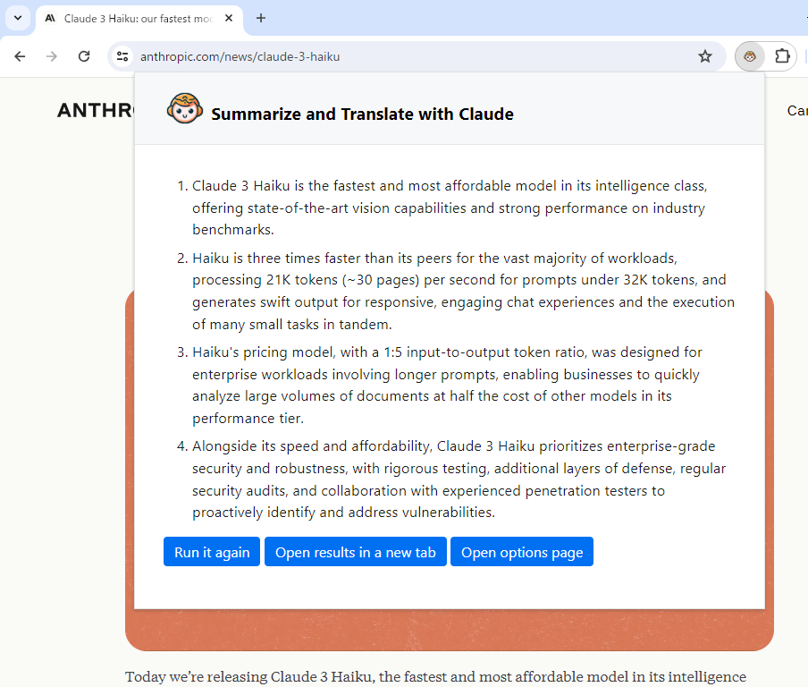
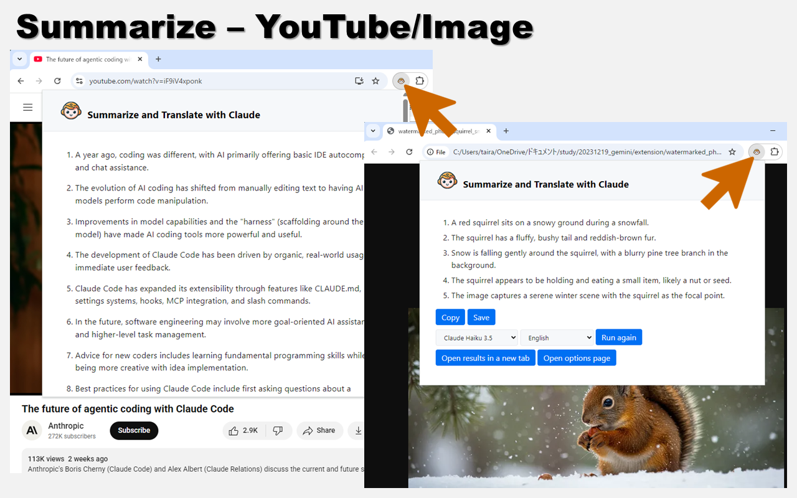
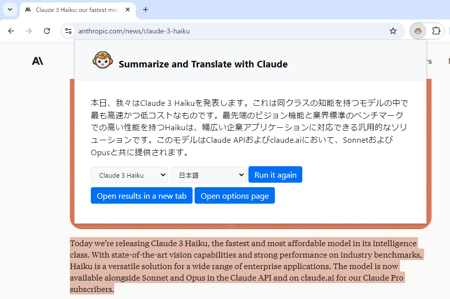
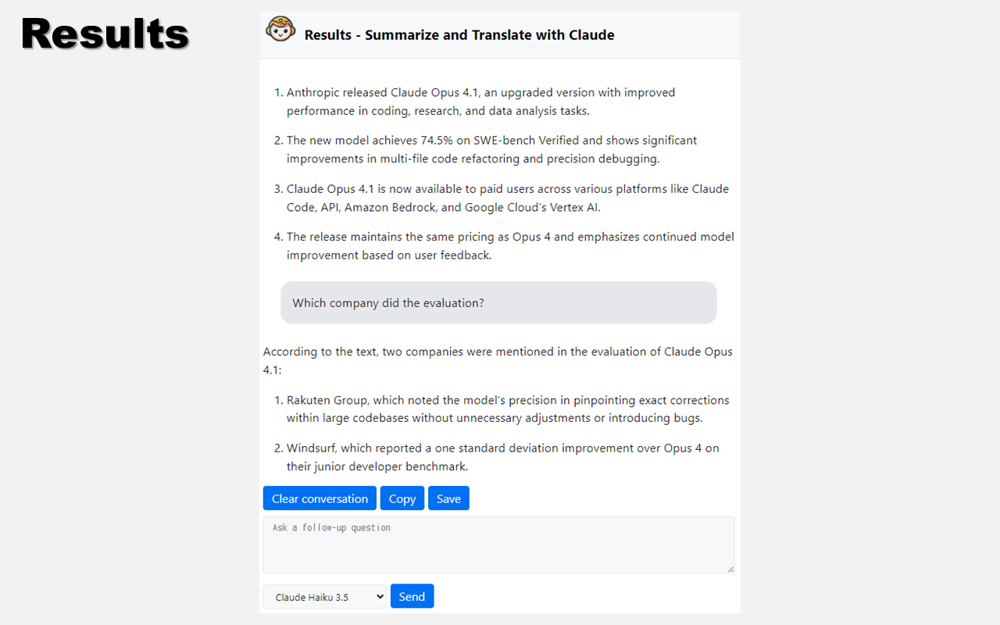

# extension-summarize-translate-claude

Chrome extension to summarize and translate web pages. Uses Claude as the backend.

## Setup

This extension is available on the [Chrome Web Store](https://chromewebstore.google.com/detail/ciikfihmdpcbmehhggahlgljimikipbm), [Microsoft Edge Add-ons](https://microsoftedge.microsoft.com/addons/detail/gfbdckjeobbamlimgcgihepkebiggjep), and [Firefox Add-ons](https://addons.mozilla.org/firefox/addon/summarize-translate-claude/).
The following are instructions for manual installation, for development purposes.

1. Open the Manage Extensions page in Google Chrome.
2. Enable Developer mode.
3. Click Load unpacked and select the `extension` directory.
4. Open the Options page, register your Claude API key, and select a language.

You can obtain a Claude API key from [Claude Platform](https://claude.com/platform/api).
This extension uses Claude Haiku 4.5 by default.

## Usage

### Summarize

Simply open a web page and click the extension icon to summarize its content.

If a YouTube video has captions, this extension will summarize the captions.
When you open an image file or a PDF, the extension summarizes the currently displayed image.

### Translate

Select the text you want to translate and click on the extension icon.

### Results

You can ask follow-up questions on the results page.

## License

MIT License  
Copyright (c) 2024-2026 Sadao Hiratsuka
